# sensor的问题以及ISP的处理原理

sensor 的物理缺陷导致下列问题，需要ISP模块进行补偿。

## 黑电平校正（Black Level Correction）BLC

### 缺陷

- 由于 sensor 电路本身存在暗电流，无光线时依然有电压输出，理想状态是全为 0。
- AD转换芯片精度不够，电压值很小时转换不出来，为了保留暗部细节，芯片厂商会刻意添加一个固定的偏移量以达到阈值转换电压。
- 传感器中像素点不完全相同，相同光线下输出电压可能有差异。
- 黑电平受曝光时间（温度）和亮度增益影响，且变化不均匀，但处理时常减去一个均值，导致RGB通道的比例发生变化，可能引起色偏。

> 影响自动白平衡 颜色校正 等的准确性

### 解决方法

通常只处理前面影响较大的两点：找到一个矫正值，所有像素值都减去这个值，就得到一个矫正成功的结果。

- 一般情况下，sensor 传感器周边，有一小部分区域是有感光器的，但是没有光透射进来。可以把这部分传感器的信号作为矫正值，从可感光部分的信号中减去，就可获得校正后的信号。
- 部分sensor会直接给出blc值。
- 自己标定，测出BLCR、BLCGr、BLCGb、BLCB

校正位置：由于存在黑电平，图像输出信号非线性，一般放在 ISP 的最前端。在传感器数据（bayer 数据域）输出后校正，即变为线性数据。

### 示例

以8bit为例，sensor输出数据范围为 【blc，255】，实际表示的亮度为【0，255-blc】，而 8bit 最终输出的亮度为 【0，255】，为了让图像亮度范围达到【0，255】，有两种方法：

- 减掉blc后，乘以一个系数使得范围达到 【0，255】；
- 减掉blc后，不乘以系数，由后续的gamma等其他方法将输出范围达到 【0，255】。

## 镜头阴影校正 （Lens Shading Correction）LSC

### 缺陷

- 亮度阴影（lamu shading）：凸透镜原理，镜头对于光学折射不均匀导致的镜头周围出现阴影的情况，，中间亮，边缘暗

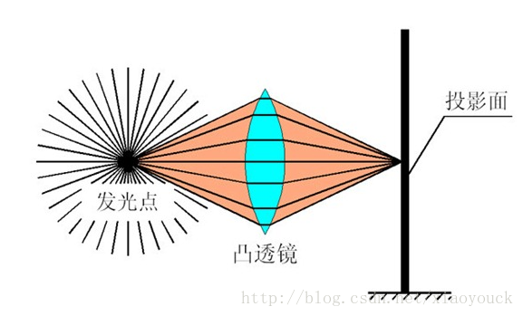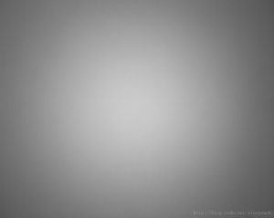

- 颜色阴影（color shading）：不同色彩不同的波长，不同的折射率

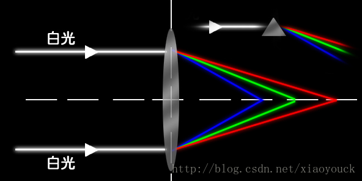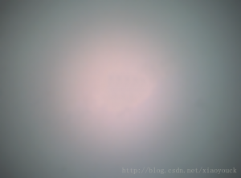

> 暗角、渐晕、色偏

### 解决方法

- 监测中间亮度均匀的部分，认为不需要矫正，以此为中心，计算出周围区域需要补偿的因子（增益）。实际操作中，把镜头对准白色物体，检查图像四周是否有暗角。
- 分别对四个通道进行校正。考虑到芯片设计的成本，因此一般情况下不会存储整幅图像的lut，目前主流的都是存储128*128个点的增益，利用双线性插值的方法计算每个像素pixel的增益。

名词解释：

- lut（look up table）：颜色查找表，一种颜色转换为对应的另一个颜色。可理解为滤镜，PS中有用到。
- 双线性插值：在 x 方向上和 y 方向上各做一次线性插值。

### 示例

存储128*128个点的增益：理想状态是对每个点进行增益，为了节省资源，取网格的交叉点，获得该点的增益。可理解为缩小后存储，使用时再放大。

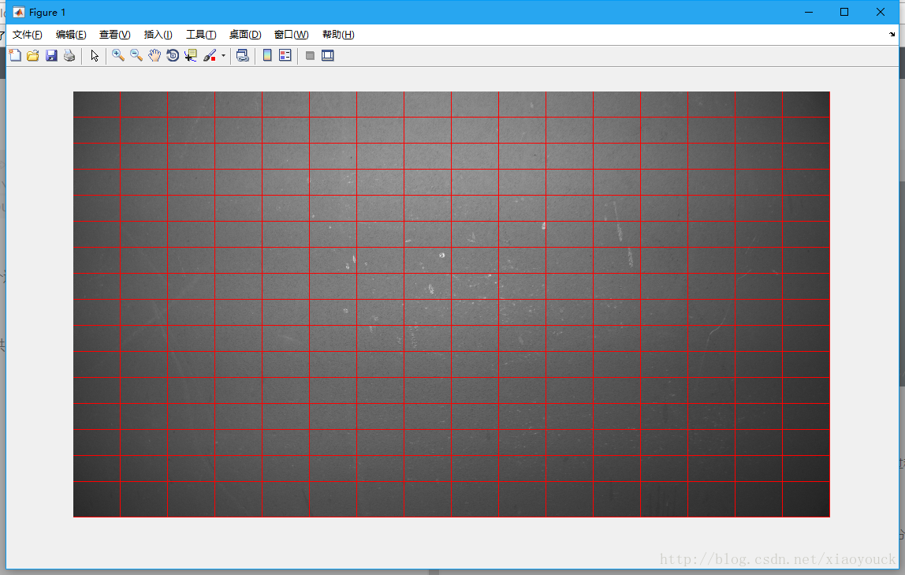

## 坏点校正（Bad Pixel Correction）BPC、（Defective Pixel Correction ） DPC

### 缺陷

- sensor 是物理器件，难以避免坏点
- 随使用时间增多
- 高温环境也会增多

在全黑环境，观察输出的亮点彩点，或白色物体下观察彩点和黑点。

静态坏点：

- 亮点：正常情况下，像素点的亮度值正比于入射光强度，异常时二者不成正比，亮度值异常的变大。曝光时间增加，亮度会显著增加。
- 暗点：无论什么入射光，接近于0。

动态坏点：在一定范围内，该点表现正常，超过时会表现的过亮。温度升高或增益加大时，动态坏点会更加明显。

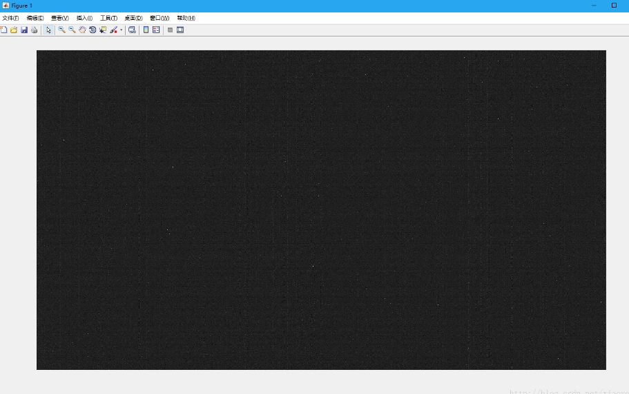

> 存在坏点，插值和滤波时会影响其他像素点

> 坏点很多时边缘会出现伪色彩的情况

### 解决方法

自动、动态：使用算法

- 监测坏点。在 RGB 域上做 5x5 的评估，如果某个点与周围的点偏离度超过阈值的点为坏点。（平均值）
- 采用更复杂的逻辑，如连续评估N帧。如梯度百分比检测坏点。
- 纠正坏点。对找到的坏点做中值滤波，替换回原来的值即可。（坏点周围值排序取中值）

静态：建立坏点表，对固定位置修复。少部分厂商会提供，大多数是用户自己查找。

- 黑暗标定
- 有光均匀标定
- 建立坏点表

## cmos 的 sensor 采用了 Bayer 色彩滤波阵列 Color Filter Array（CFA）

发明人：Bryce Bayer —— 柯达公司工程师

色彩滤波阵列：传感器上方的一层马赛克覆盖层，采集颜色信息。

### 缺陷

* 一般的光电传感器只能感受光的强度，不能分辨波长。
* 通过滤波只允许特定波长的光透过，收集不同波长的光强度，再通过色彩合成算法合成。常见的 RGGB Fliter。人眼对绿色更敏感。
* bayer色彩滤波阵列中，二分之一是绿色，剩余二分之一是红色和蓝色，生成的值是三个颜色交替存在的，并不是完整的三个颜色分量的值。

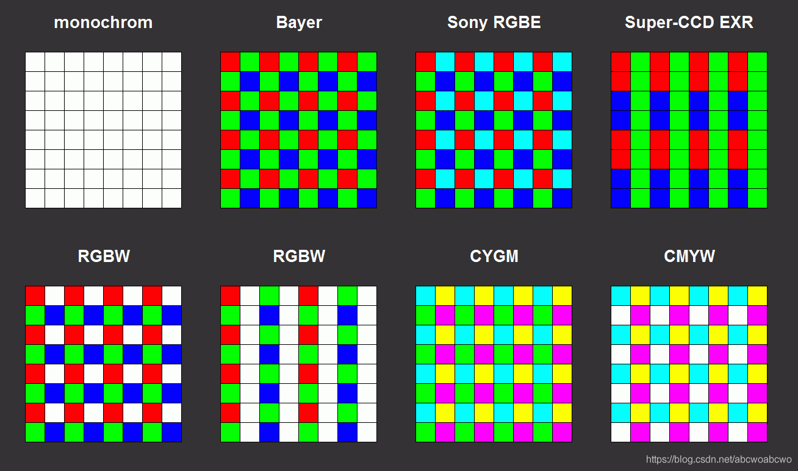

### 解决方法

#### 颜色插值（color filter array）CFA

原理：通过距离最近的几个像素值，计算出当前像素的的值，插入缺失的位置上，形成完整的RGB三色值。常用的如内插法。

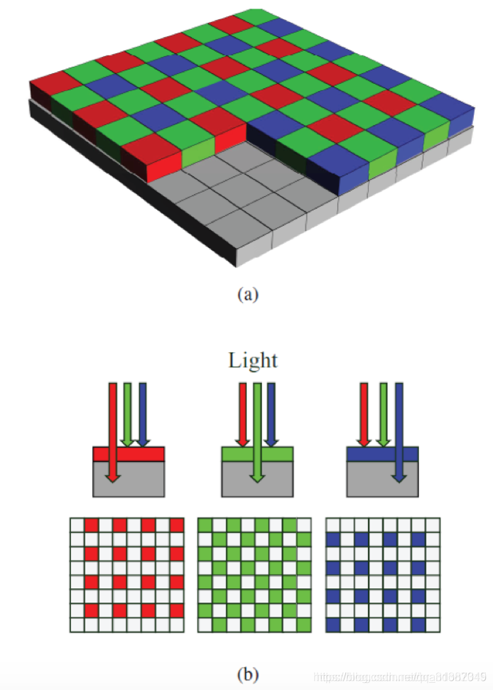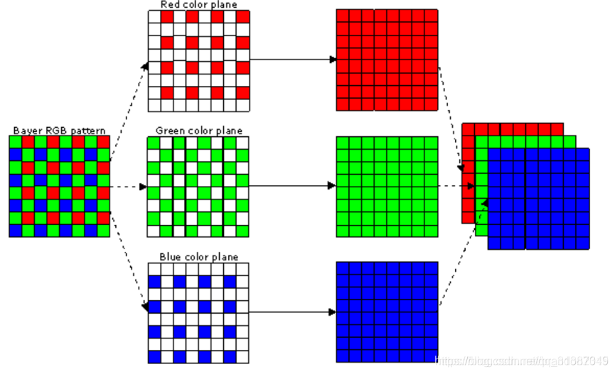

## Bayer 降噪（Bayer noise reduction） BNR

### 缺陷

- sensor 感光部件包含模拟部分，所以信号中的噪声很难避免，ADC器件本身也会引入噪声。
- 另外，当光线较暗时，整个系统需要将信号放大，这样噪声也跟着放大。视觉感受为雪花点。
- 前面处理模块的增益放大噪点。

### 解决方法

过于专业，有兴趣可参考[博客](https://blog.csdn.net/wtzhu_13/article/details/122158378)

* 平均算法降噪：对同一个色彩通道的像素点进行平均值运算，减少噪声的影响。
* 高斯滤波器降噪：采用高斯滤波器，对图像进行平滑处理，去除噪点。
* 中值滤波器降噪：使用中值滤波器，去除图像中的噪点。
* 适应性降噪：根据图像的特征，自适应地选择不同的降噪方式。
* 空间降噪：利用不同位置上像素点之间的相关性，对图像进行降噪处理。

高斯滤波器所做的操作是将每个像素点的值，按照一定比例与其周围像素值的加权平均进行处理。这种加权平均的形式是一个高斯分布，因此称为高斯滤波器。

在采用高斯滤波器进行降噪时，需要确定滤波器大小和标准差（即高斯分布的方差）。通常情况下，滤波器大小越大，降噪效果越明显，但同时也会导致图像的模糊度增加；而标准差越小，则会更加保留图像的细节信息，但可能法完全去除噪点。

总的来说，高斯滤波器降噪是一种简单而有效的方法，但需要根据实际情况来选择滤波器大小和标准差，以达到最佳的降噪效果。

## 自动白平衡 （Auto White Balance）AWB

### 缺陷

- 人类的视觉系统有一定的颜色恒常性的特点，具有视觉修正的功能，不会受到光源颜色的影响。sensor不具备这样的特点。

### 解决方法

原理：让不同色温光线条件下的白色物体，通过转换还原为白色。

白色的物体在不同的光照条件和白平衡参数下表现如下：

- 光照色温  =  白平衡设置色温 ：白色
- 光照色温  >  白平衡设置色温 ：偏冷，偏蓝色
- 光照色温  <  白平衡设置色温 ：偏暖，偏黄色

环境的色温是不停变化的，如：日出、正午太阳、阴天。所以需要自动白平衡适应变化。

步骤：

- 检测色温：估算图像白色位置，通常选取特定区域像素计算。需要有一定的约束条件。
- 计算增益：计算R/B要调整的增益，将Cr，Cb调整到接近0的两个系数，R=G=B。
- 色温矫正：根据增益调整色温。

### 示例

理论：Von Kries 色适应

一个物体在光源 A 下 RGB 值为 RGB1 = 【R1，G1，B1】，在光源 B 下 RGB2 = 【R2，G2，B2】，那么每个通道存在一个系数将这两个值互相转换。RGB2 = {kr，0，0；0，kg，0；0，0，kb} * RGB1，其中 kr，kg，kb 为转换系数。

#### 如何找K？

灰度世界算法：对于一张色彩丰富的图片，图像上 RGB 三个通道的平均值应该等于一个被成为灰色值的 K。灰色值有几种定义方式：

- 取各通道最大值的一半。如 255，则 k = 127 或 128
- 将待处理图片三个通道均值的均值作为灰色值。k = （R平均+G平均+B平均）/ 3

校正系数为 kr = K/Rmean，kg = K/Gmean，kb = K/Bmean。

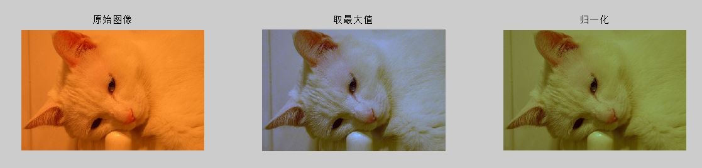

完美反射法（镜面法）：图像中存在一个镜面，在特定光源下，获得的色彩信息认为是当前光源的信息。在白色光源下进行校准的时候，假设存在镜面，则存在一个色值为 #FFFFFF 的纯白色像素点。此时校正系数为 kr = 255/Rmax，kg = 255/Gmax，kb = 255/Bmax。Rmax，Gmax，Bmax 为图像 RGB 通道的最大值。

方案：自动校正。

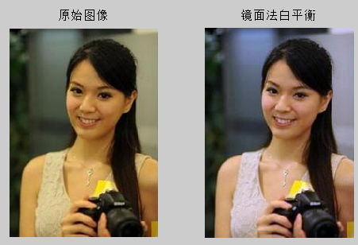

## 颜色校正 （Color Correction Matrix）CCM

### 缺陷

- sensor 滤光板处各颜色块之间的颜色渗透带来的颜色误差
- 白平衡对白色完成矫正，这一步对其他颜色进行矫正。

### 解决方法

原理：将拍摄到的图像与标准图像对比，计算得到一个校正矩阵。校正过程中都会伴随着饱和度的变化调整。

工具：标准 24 色卡，图像分析软件（imagetest）。

## Gamma 校正

### 缺陷

- 人眼对暗部细节比sensor敏感
- 在黑暗条件下，随着光线逐渐增强，一开始人眼的感知非常明显，然后逐渐减弱。
- sensor对光线变化的感知是线性的。

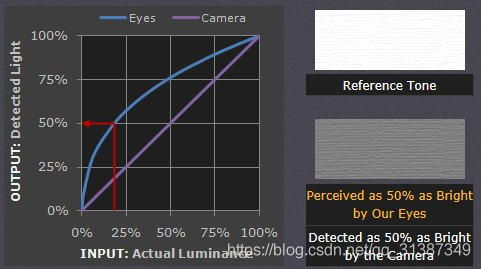

### 解决方法

- 使用幂函数拟合非线性的映射：Y=X^γ
- 查表法：根据一个伽马值，将不同亮度范围的理想输出值在查找表中设定好，在处理时，根据输入的亮度查表得到其理想的输出值 。

### 示例

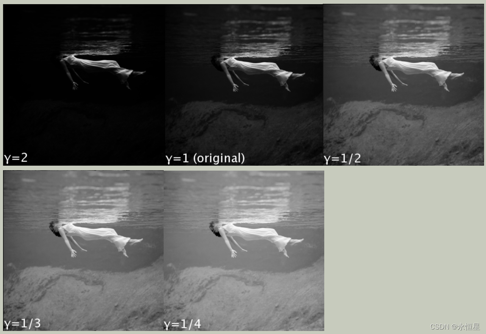

## sensor 的输出的 RAW data 是RGB，但是有的处理在YUV上更方便，且YUV存储和传输时更省带宽。

在YUV色彩空间上进行彩色噪声去除、边缘增强等更方便。

### RGBtoYUV 色彩空间转换

原理：YUV是一种基本色彩空间，人眼对亮度 Y 改变的敏感性远比色彩变化大很多，因此，对于人眼而言，亮度分量 Y 要比色度分量 UV 重要的多。所以只有YUV 444 格式的 YUV 数据的比例是 1：1：1，其他各种格式，如 YUV422，YUV420 等格式，UV的数据量都小于 Y，达到节省空间和传输带宽的目的。

YUV 和 RGB 转换有固定的公式。

YCbCr的相互转换：Y = 0.299R + 0.587G+0.114B

    Cb = 0.564（B-Y）

    Cr = 0.713（R-Y）

实时计算，不需要提前调校

处理效果：人眼看不出图像质量变化

## HDR

### 缺陷

- sensor 在一定曝光量下，较暗部分或较亮部分的细节显示不充分

### 解决方案

为保证人眼看到的世界和显示器后者摄像头采集的图像范围相差无几，甚至更好，需要通过色调映射（ tone mapping） ，将暗处和亮部细节再现，这是一种纯粹为了视觉感受而进行的处理，并非真正的 HDR，也称为 WDR。

原理：通过tone mapping 的方法，将像素值在特别暗的区域拉高，在特别亮的区域拉低。

有以下几种：

- global tone mapping
  a. 单一 tone 曲线。对整幅图低拉高，高拉低。（缺点，蒙上一层雾的感觉，因为数值压缩后往中间靠拢，局部对比度下降）
  b. 双边滤波，tone mapping。在图像中局部边缘处不会进行 tone mapping，以保持局部细节。
- local tone mapping
  a.虚拟曝光。通过多帧相加确定哪些区域是高亮区，哪些区域是低亮区，然后分区进行 local tone mapping。
  b. local gamma。图片分成多块，对每块进行伽马校正。主要根据每块的亮度直方图进行动态调整 gamma 曲线。

#### HDR、WDR区别

WDR（Wide Dynamic Range）指的是在同一张图片或者视频中，有一部分区域的亮度差异非常大，例如既有强烈的光源，又有暗处的细节。WDR技术可以通过在不同的曝光条件下获取多张图片或者视频，并将它们合成为一张“宽动态范围”的图像，使得整张图片的亮度范围更广，能够更好地展示出高亮和阴影部分的细节。

HDR（High Dynamic Range）是一种更为通用的技术，它可以应用于视频、照片、游戏等多个领域。HDR技术通过最大限度地提高亮度和色彩的表现力，使得图像能够更真实、更生动地呈现出现实世界的场景。HDR技术的实现方式往往是通过多个曝光等级的组合，或者通过数学算法来提高图像的亮度、对比度和色彩饱和度等方面的表现力。

## 自动曝光AEC（Automatic Exposure Control）

不同场景下，光照强度有很大的区别。人眼有着自适应的能力，因此可以很快的调整，使自己可以感应到合适的亮度。而图像传感器却不具备这种自适应能力，因此必须使用自动曝光功能来确保拍摄的照片获得准确的曝光，从而具有合适的亮度。

原理：

1. 光强测量：利用图像的曝光信息获得当前光照信息的过程。可以统计全部像素，也可以统计图像中间部分，也可以将图像分成不同部分，赋予不同的权重。
2. 场景分析：获得当前光照的特殊情况，如没有背光照射或正面强光。对这些信息进行分析，可提升图像传感器的易用性，大幅提高图像质量。主要有模糊逻辑和人工神经网络算法。这些算法比起固定分区测光算法具有更高的可靠性。
3. 曝光补偿：完成前两步之后，调节相应参数使得曝光调节生效。主要是调节曝光时间和曝光增益。

处理流程：实时计算，需要提前调校。

### 自动对焦AF

原理：判断图像的模糊程度，通过模糊度评价函数求得采集的每一幅图像评价值，通过搜索算法得到一系列评价值的峰值，通过点击驱动将采集设备调节到峰值所在的位置，得到最清晰的图像。

对焦评价函数：有很多种，主要考虑的有图像频率（清晰图像纹理多，高频分布较多），图像灰度分量的分布（灰度图的分量分布范围越大，说明细节越多，反映清晰程度。）

常见的搜索算法有：爬山算法，搜索窗口有黄金分割点对焦嵌套窗口等。

处理方式：实时计算，提前调校

效果：如手机。

## 3A

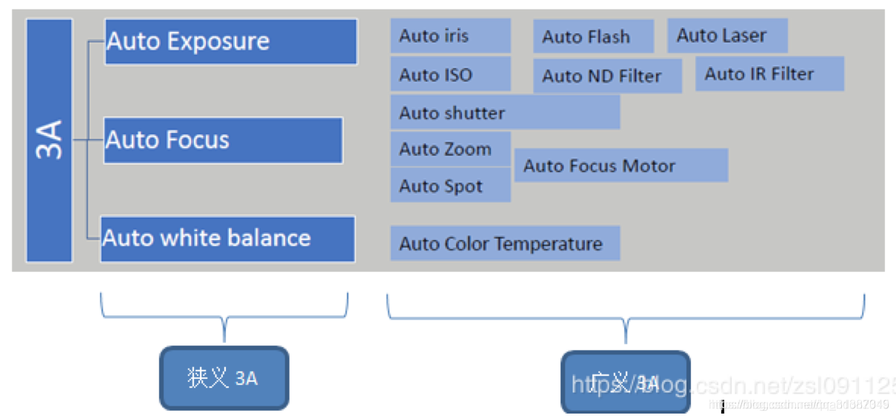
