# 数据库的体系结构

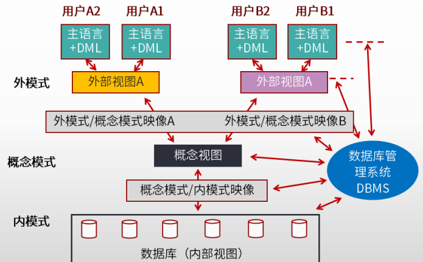

## 视图

> 视图不是真实存在的基础表，是从一个或多个表中导出的，动态生成的虚拟表。

## 三级模式

| 概念模式                     | 外模式                             | 内模式                                                                                                               |
| ---------------------------- | ---------------------------------- | -------------------------------------------------------------------------------------------------------------------- |
| **全体**数据的逻辑结构 | **用户**看到或使用的逻辑结构 | 物理结构和存储方式的描述， 数据在数据库内部的表示方式， 定义所有的内部记录类型、 **索引**和文件 |

> 外模式屏蔽了不同的用户使用的不同语言与方式。
>
> 概念模式为完整的，不受外部和存储介质影响的数据逻辑结构。
>
> 内模式描述数据是怎么在硬件上存储的。

类比：

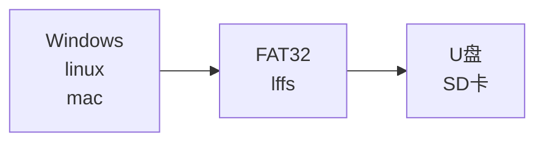

## 两级映像

| 逻辑独立性                                                                                               | 物理独立性                                                                                               |
| -------------------------------------------------------------------------------------------------------- | -------------------------------------------------------------------------------------------------------- |
| 外模式到概念模式之间的映射。 应用程序与数据库中逻辑结构独立， 逻辑结构改变时，应用程序不改变。 | 概念模式和内模式之间的映射。 应用程序与磁盘中的数据相互独立。 当物理存储改变时，应用程序不变。 |

# 数据模型

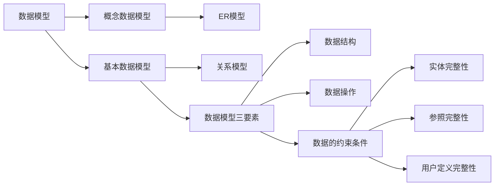

## 概念数据模型-用于设计

- 用户观点对数据信息建模，实体与实体之间的联系。实体-联系模型。Entity-Relationsh Approach，即 ER 模型。

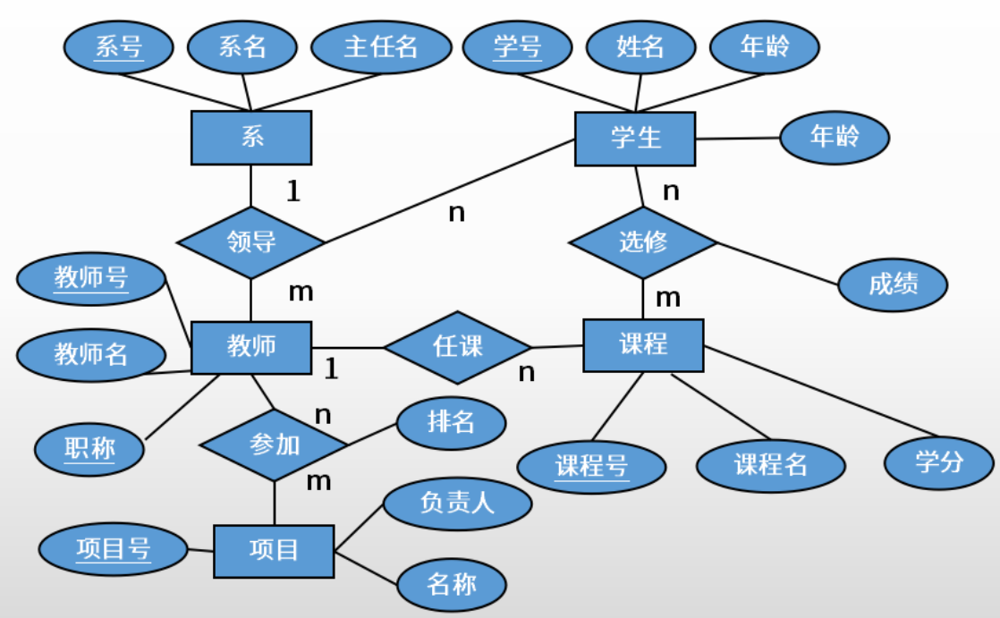

## 基本数据模型-用于实现

- 计算机系统的观点对数据信息建模，形成二维的数据结构。

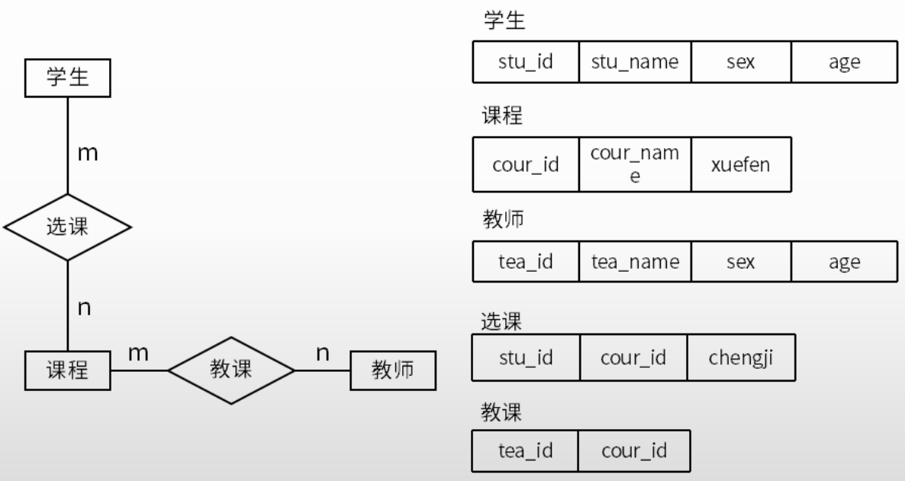

### 三要素

- 数据结构：通过一个表找到另一个表的数据，如通过学生的信息表，找到老师的信息表。
- 数据操作：增删改查。
- **数据的约束条件**
  - 实体完整性：主属性不能为空。如学生表中，学号的唯一性，故学号为主属性，其他信息可以通过学号查表得到。
  - 参照完整性：外键参照的完整性。如学生表中，其中一个属性系号是系表的主属性，即外键。外键要么为空，要么一定正确。
  - 用户定义完整性：某些数据满足一定的约束条件。如性别只有男、女；年龄不可能为负数。

# 关系代数运算

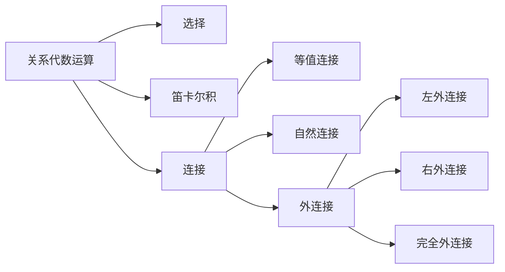

## 名词

关系型数据库

| 概念     | 名词解释                                                                    |
| -------- | --------------------------------------------------------------------------- |
| 关系     | 基本数据结构，二维表，关系名就是表名                                        |
| 元组     | 二维表中的一行，常称为记录 。                                               |
| 属性     | 列，也称为字段                                                              |
| 域       | 取值限制，如成绩分数不为负数                                                |
| 关键字   | 唯一标识元组的属性，如学生表中的学号                                        |
| 关系模式 | 对关系的描述，格式：关系名 （属性1，属性2，……，属性N ，数据中成为表的结构 |

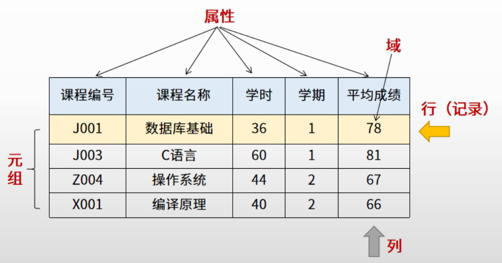

## 选择

> 选择：取得关系R中符合条件的行。数字为第 n 个属性，单引号中的数字为值。

例：

- σ~1~≥~6~ （R）：表示选取关系R中第一个属性值大于等于第六个属性值的元组。
- σ~1~≥~‘6’~（R）：表示选取关系R中第一个属性值大于等于 6 的元组。

第n个元组，可以使用数字表示，也可以使用元组的属性（字段）表示

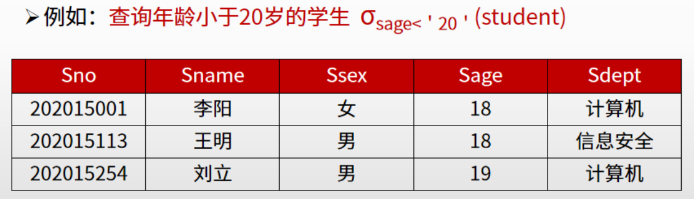

## 投影

> 取得关系R中符合条件的列组成新的关系

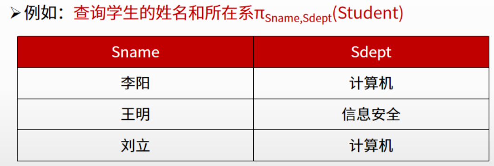

## 笛卡尔积

- 若关系R有n列，关系S有m列，则RXS的元组数为：n列Xm列 = （n+m）列。
- 若有属性名相同，则在前面增加关系名区别。

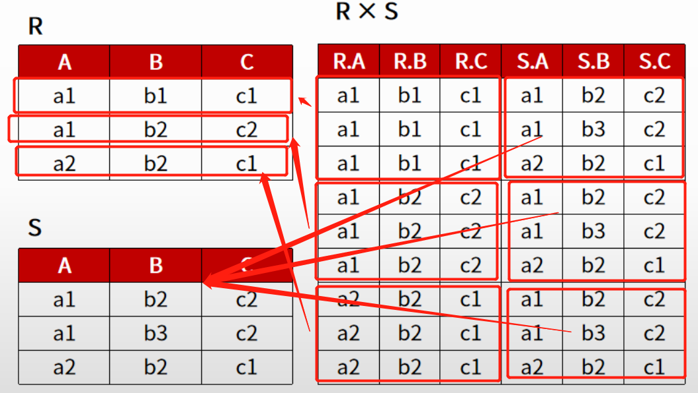

## 自然连接

> 等值连接：取笛卡尔积中属性相等的元组连接
>
> 自然连接：特殊的等值连接，去除重复属性

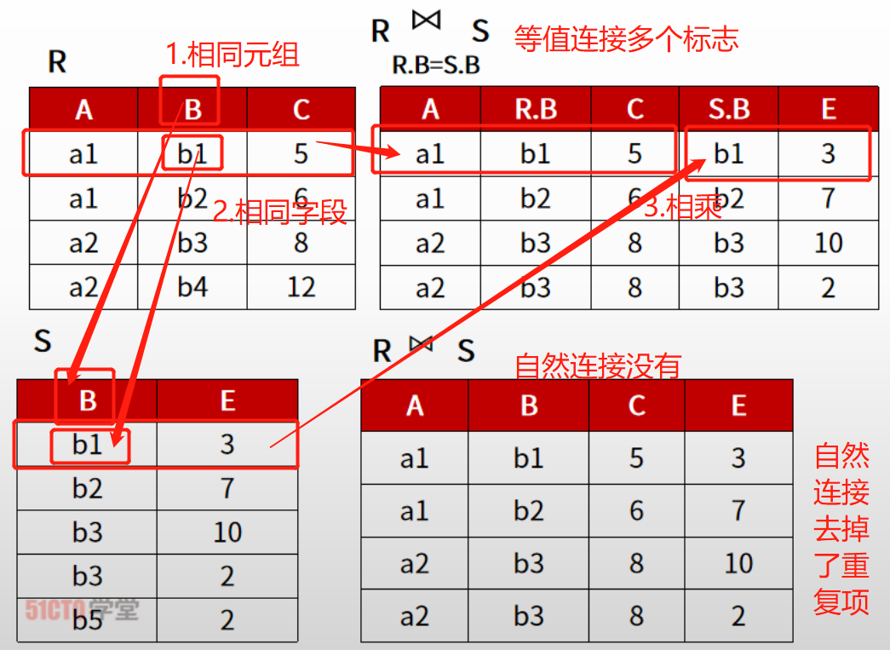

- 相同属性，属性值相同即可以连接
- R 的每个元组遍历 S 的每个元组，若可以连接则保留，否则跳过

## 外连接

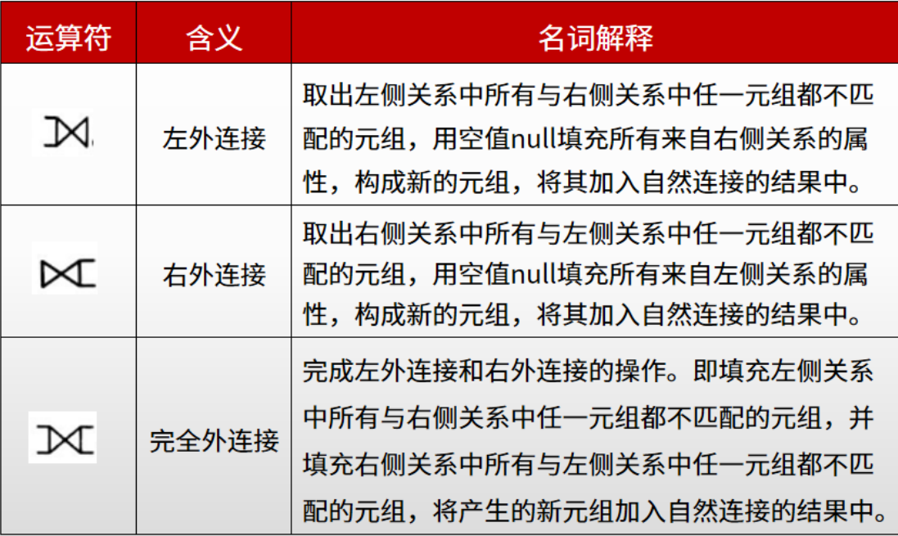

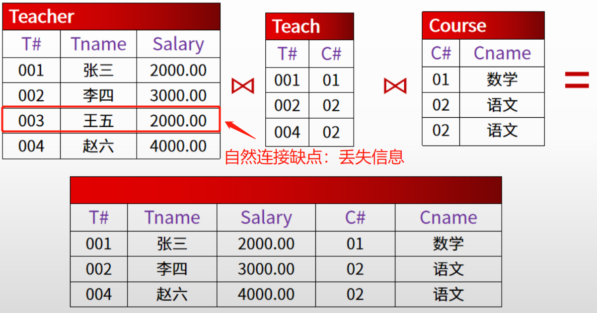

假设有关系 R，S

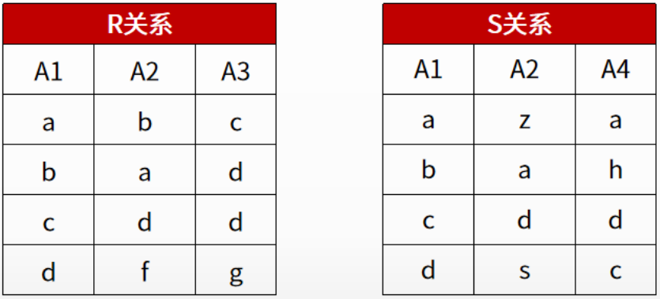

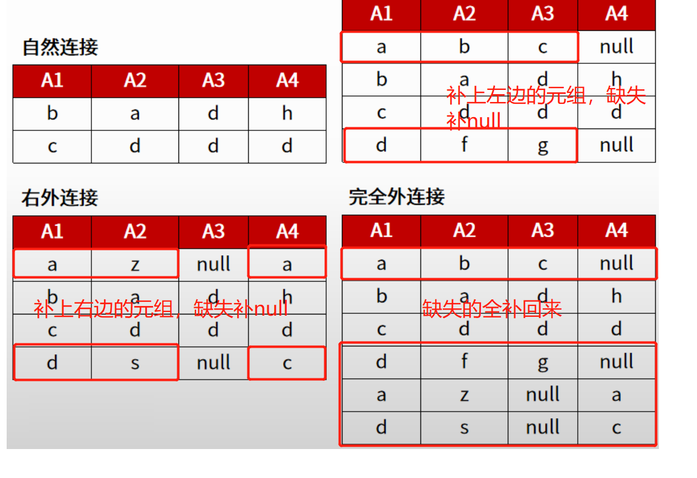

# 关系数据库的规范化

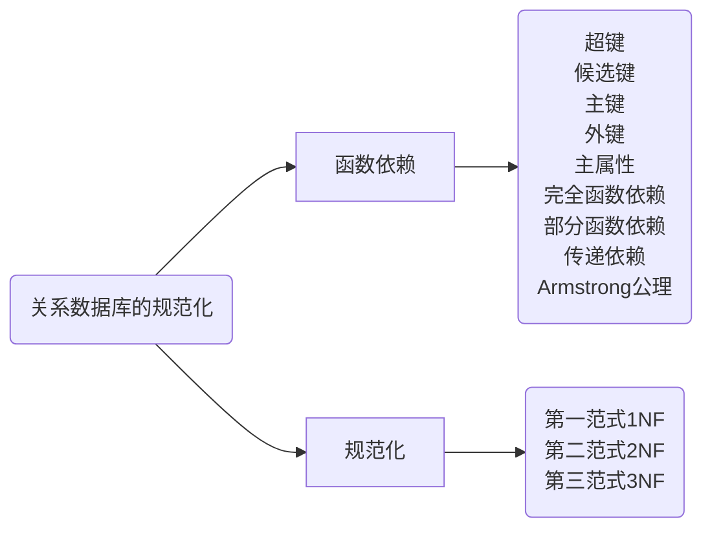

> 官方定义过于抽象可以不用记
>
> 简单记为 X → Y，则 Y 依赖于 X
>
> → 表示为推导出，后面所有都用该符号表示

依赖分为：

- 平凡依赖：$X \subseteq Y$
- 非平凡依赖：$Y \subseteq X$

> 后续的所有学习，都是讨论非平凡函数依赖

## 名词解释：

> 理解加粗

两个关系示例

> 学生：学号、姓名、性别、身份证号、教师编号
>
> 教师：教师编号、姓名、工资

- 超键：
  - 关系中的唯一标识，可以由一个或多个属性组成
  - 如：学号、学号+身份证号、全部加起来都可以是超键
- **候选键**：
  - 不含有多余属性，是超键的最小子集，有一个或多个属性构成
  - 如学号、身份证号
- **主键**：
  - 用户挑选，作为元组标识的候选键
  - 如学生关系一般为学号
- 外键：
  - 某个属性是其他关系的主键，一般用于表的连接
  - 如教师编号
- **主属性**：
  - 包含在任意一个候选键中的属性，否则为非主属性
  - 如身份证号

## 函数依赖

- **完全函数依赖**
  - 如主键学号+课程 → 课程成绩，学号和课程缺一不可
- **部分函数依赖**
  - 如主键学号+课程 → 名字，仅依赖学号即可完成推导
- **传递依赖**
  - 如 学号 → 系号，系号 → 系主任，则 学号→系主任，间接的推导出

### Armstrong 公理

> 理解加粗，可能有点抽象，刷题过程中能够慢慢理解。

- 自反律：若$Y \subseteq X \subseteq U$，则 X → Y 被 F 所蕴含
- **增广律**：若 X → Y 为 F 所蕴含，且 $Z \subseteq U$，则 XZ → YZ 为 F 所蕴含
- **传递律**：若 X → Y，Y → Z 为 F 所蕴含，则 X → Z 为 F 所蕴含
- **合并规则**：若 X → Y， X → Z，则 X → YZ 为 F 所蕴含
- 伪传递规则：若 X → Y，WY → Z，则 XW → Z 为 F 所蕴含
- 分解规则：若 X → Y， $Z \subseteq Y$，则 X → Z 为 F 所蕴含

## 规范化

> 逐级递增的关系，如满足3NF，则必定满足1和2NF。

- **1NF**
  - 属性不可拆分
  - 如地址（省、市、区），属性包含几个子属性
  - 考试所有的题目都满足
- **2NF**
  - 完全依赖主键
- **3NF**
  - 不存在传递

> 口诀：全赖2不传3

# 数据库的控制功能

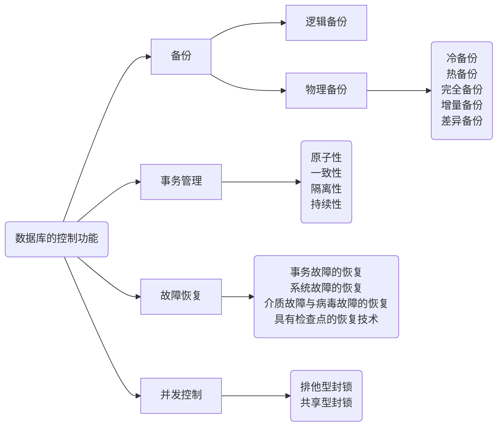

## 事务管理

> 理解记忆，描述一个现象识别出是哪种。

- 原子性
  - **操作**要么全做要么不做
  - 如转账
- 一致性
  - **数据**总是一致的状态
  - 如10元余额，向一个人转10元，余额从10元变0元的过程是完整的，若这个过程被破坏，余额变成0元前发起另一个10元转账，可能会产生20元的转账。这里针对数据。
- 隔离性
  - **执行**不受其他事务干扰
  - 理解为编程中多线程访问全局变量的问题，多个线程同时修改、访问可能会互相影响执行。这里针对执行。
- 持久性
  - **变化**是永久性的
  - 事务处理结束后，对数据的修改是永久性的，你可以改回去，但你改过的事实是存在的。

## 并发控制

> 有开发经验应该都懂

- 排他型封锁：写锁
- 共享型封锁：读锁

## 备份

> 区分冷热备份

- 物理备份-操作系统层面
  - 冷备份：关闭数据库
  - 热备份：不用关闭，可用软件
- 逻辑备份-自己管自己

> 了解有印象

- 完全备份：全部，安全，时间长
- 增量备份：上次完全或差异备份以来修改的数据
- 差异备份：完全备份后变化的所有数据

## 故障恢复

> 需要理解逻辑，题目中的信息能帮助你回忆起来

- 事务故障的恢复
  - 反读日志，逆操作，恢复到事务开始的状态
- 系统故障的恢复
  - 找故障前提交的事务重做，未完成的事务逆操作，然后全部重做
- 介质故障与病毒破坏的恢复
  - 装副本，找故障前提交的事务重做，将数据恢复到故障前的某时刻的状态
- 具有检查点的恢复技术
  - 找到检查点正在执行的事务撤销

# 数据库设计

> 记住加**标记的，其他印象

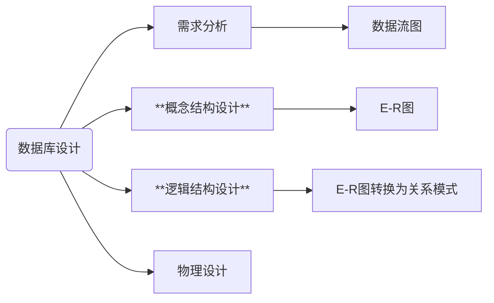

## 概念设计的步骤

> 重点加粗，会给一个例子，问是什么冲突

- 需求分析
- 局部E-R模式设计
  - 确定局部视图范围
  - 识别实体及其标识
  - 确定实体间的联系
  - 分配实体及联系的属性
- 全局E-R模式设计

局部与全局的E-R设计，存在以下冲突

- **属性冲突**
  - 属性域冲突：理解为类型冲突，如同一个属性，一个用 int ，一个用 char
  - 属性值冲突：理解为单位，一个用公斤，一个用斤
- **结构冲突**
  - 抽象不同：设计一个“订单”实体，一个人将订单抽象成了“订单基本信息+订单明细”，而另一个人将订单抽象成了“订单基本信息+客户信息+产品信息”，这就造成了抽象不同引起的结构冲突。
  - 属性个数和排列次序不同：理解差异，如用户对象，有人认为需要家庭属性，有人认为不需要；有的把名称排在第二位，有的不是
- **命名冲突**
  - 同名异义：如订单表中使用 name，A工程师定义为客户名，B工程师定义为产品名
  - 异名同义：如订单表中表示客户名，A用 client 表示，B 用 name 表示

## 逻辑结构设计

> 重点是理解如何解决冲突，找到最合适的选项

E-R 图向关系模式转换规则：

- E-R图的实体转换为关系
- 属性转换为关系属性
- 关键字转换为关系的关键字

### 复合属性转换

- 将每个分量属性，作为复合属性所在实体的属性（分量替换复合）
- 将复合属性本身作为实体的属性（复合替换分量）

如：公民 （身份证号，名字，年，月，日）；公民 （身份证号，名字，出生日期）

### 多值属性转换

- 将多值属性与所在实体的主键一起组成一个新的关系
- 将多值属性提升为一个实体，通常为弱实体

弱实体：依赖于实体存在，如患者家属。

如：学生 （学号，姓名）； 选课 （学生，所选课程）

### 派生属性

- 由其他属性计算得到，不用转换

如：出生日期可以计算出年龄

### BLOB属性（没考过，略）

### 联系属性

#### 1：1

- 一个1：1的联系可以转换为一个独立的关系模式

1：1联系：教师 - 管理 - 班级

如：管理 （工号，班号，……）

- 与任意一端对应的关系模式合并

如：班级 （班号，人数，工号，……）

或：教师 （工号，姓名，性别，班号，……）

#### 1：n

- 一个1：n的联系可以转换为一个独立的关系模式

如：组成 （学号，班级号，……）

- 与n端对应的关系模式合并

如：学生 （学号，姓名，生日，班级号，系号，……）

#### n：m

- 一个n：m的联系可以转换为一个独立的关系模式

如：选修 （学号，课程号，成绩，……），其中学号和课程号的关系模式的组合（联合）主键。

#### 多元的联系

1课程：1教科书：ni教师

- 一个多元的联系可以转换为一个独立的关系模式

如：讲授 （职工号，课程号，书号，……），其中课程号，职工号，书号为关键模式的组合（联合）主键。

# 分布式数据库

# nosql数据库

# 数据库优化技术
