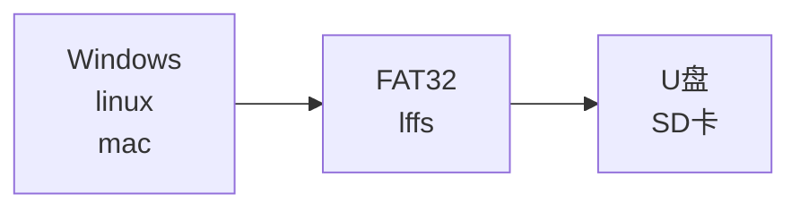
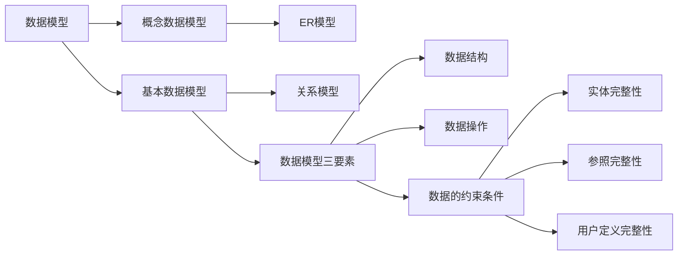
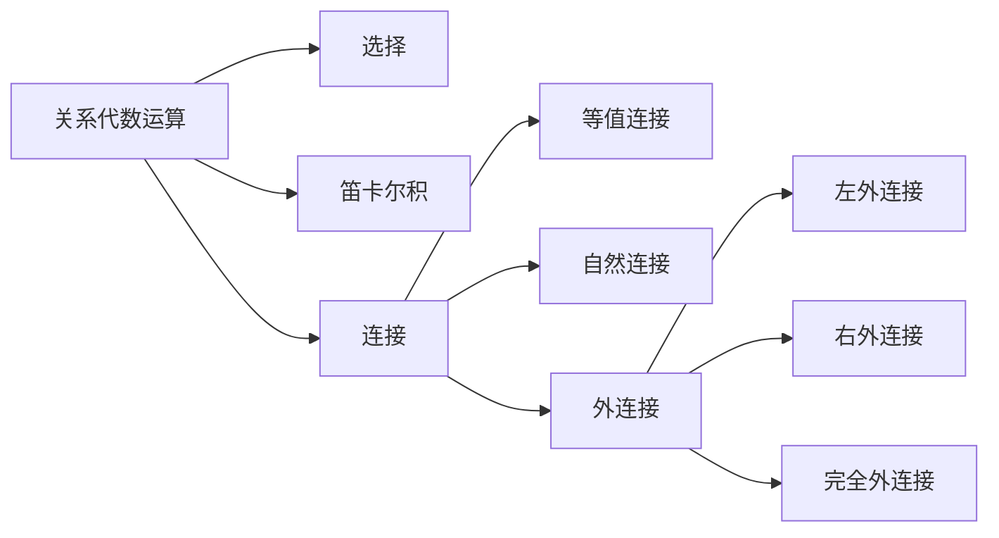
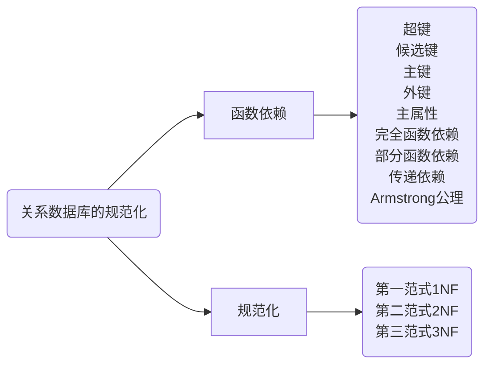
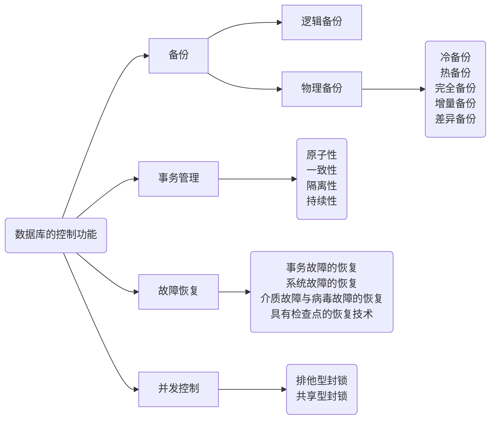
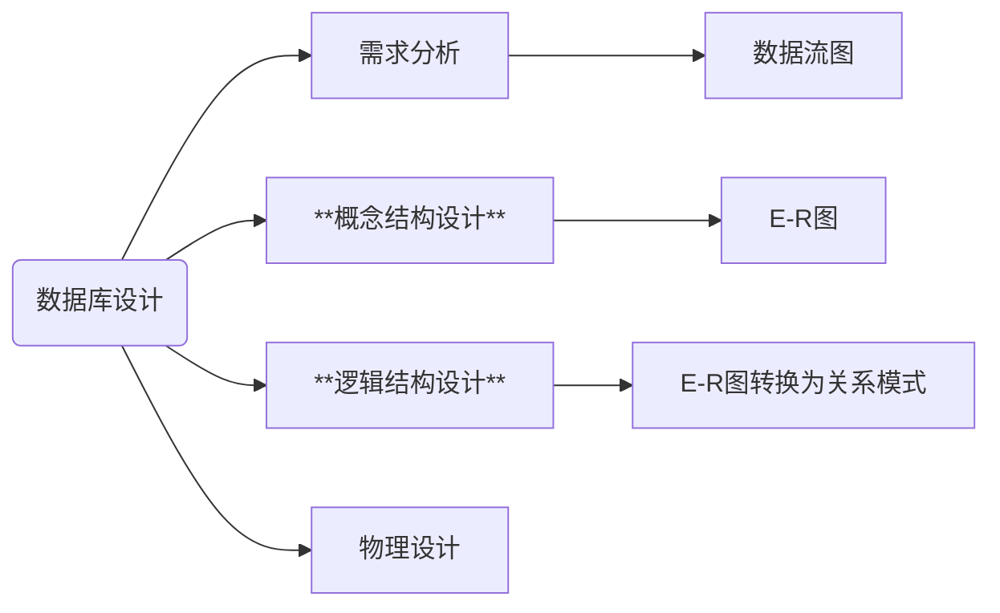
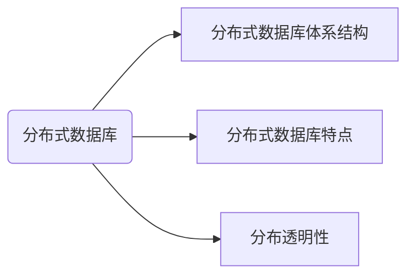
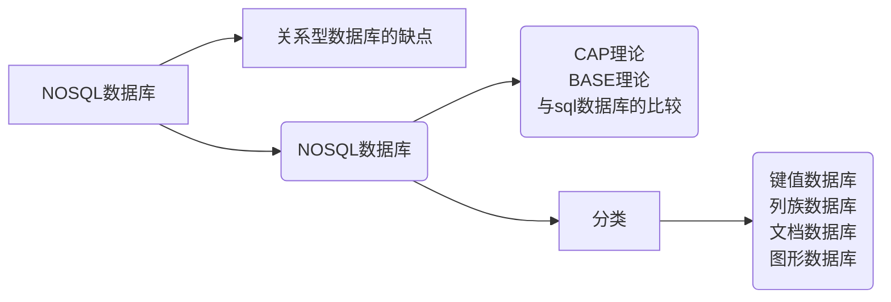
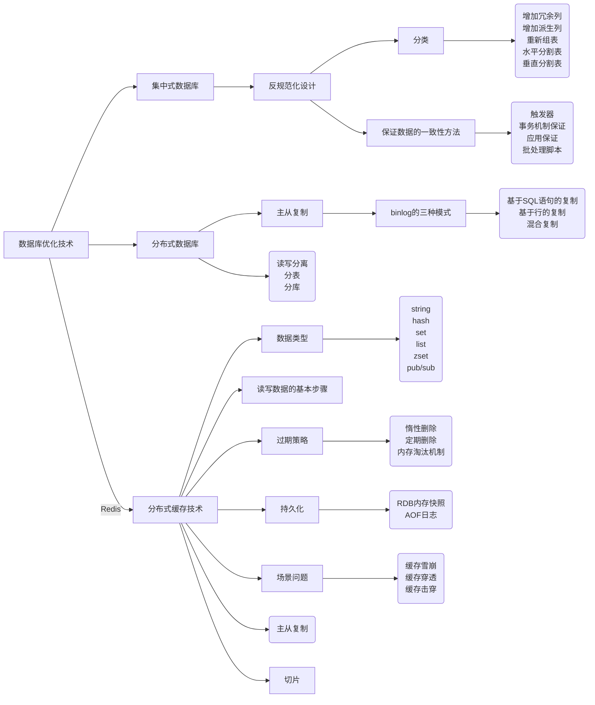

# 数据库的体系结构

## 视图

> 视图不是真实存在的基础表，是从一个或多个表中导出的，动态生成的虚拟表。

## 三级模式

| 概念模式                     | 外模式                             | 内模式                                                                                                               |
| ---------------------------- | ---------------------------------- | -------------------------------------------------------------------------------------------------------------------- |
| **全体**数据的逻辑结构 | **用户**看到或使用的逻辑结构 | 物理结构和存储方式的描述， 数据在数据库内部的表示方式， 定义所有的内部记录类型、 **索引**和文件 |

> 外模式屏蔽了不同的用户使用的不同语言与方式。
>
> 概念模式为完整的，不受外部和存储介质影响的数据逻辑结构。
>
> 内模式描述数据是怎么在硬件上存储的。

类比：

## 两级映像

| 逻辑独立性                                                                                               | 物理独立性                                                                                               |
| -------------------------------------------------------------------------------------------------------- | -------------------------------------------------------------------------------------------------------- |
| 外模式到概念模式之间的映射。 应用程序与数据库中逻辑结构独立， 逻辑结构改变时，应用程序不改变。 | 概念模式和内模式之间的映射。 应用程序与磁盘中的数据相互独立。 当物理存储改变时，应用程序不变。 |

# 数据模型

## 概念数据模型-用于设计

- 用户观点对数据信息建模，实体与实体之间的联系。实体-联系模型。Entity-Relationsh Approach，即 ER 模型。

## 基本数据模型-用于实现

- 计算机系统的观点对数据信息建模，形成二维的数据结构。

### 三要素

- 数据结构：通过一个表找到另一个表的数据，如通过学生的信息表，找到老师的信息表。
- 数据操作：增删改查。
- **数据的约束条件**
  - 实体完整性：主属性不能为空。如学生表中，学号的唯一性，故学号为主属性，其他信息可以通过学号查表得到。
  - 参照完整性：外键参照的完整性。如学生表中，其中一个属性系号是系表的主属性，即外键。外键要么为空，要么一定正确。
  - 用户定义完整性：某些数据满足一定的约束条件。如性别只有男、女；年龄不可能为负数。

# 关系代数运算

## 名词

关系型数据库

| 概念     | 名词解释                                                                    |
| -------- | --------------------------------------------------------------------------- |
| 关系     | 基本数据结构，二维表，关系名就是表名                                        |
| 元组     | 二维表中的一行，常称为记录 。                                               |
| 属性     | 列，也称为字段                                                              |
| 域       | 取值限制，如成绩分数不为负数                                                |
| 关键字   | 唯一标识元组的属性，如学生表中的学号                                        |
| 关系模式 | 对关系的描述，格式：关系名 （属性1，属性2，……，属性N ，数据中成为表的结构 |

## 选择

> 选择：取得关系R中符合条件的行。数字为第 n 个属性，单引号中的数字为值。

例：

- σ~1~≥~6~ （R）：表示选取关系R中第一个属性值大于等于第六个属性值的元组。
- σ~1~≥~‘6’~（R）：表示选取关系R中第一个属性值大于等于 6 的元组。

第n个元组，可以使用数字表示，也可以使用元组的属性（字段）表示

## 投影

> 取得关系R中符合条件的列组成新的关系

## 笛卡尔积

- 若关系R有n列，关系S有m列，则RXS的元组数为：n列Xm列 = （n+m）列。
- 若有属性名相同，则在前面增加关系名区别。

## 自然连接

> 等值连接：取笛卡尔积中属性相等的元组连接
>
> 自然连接：特殊的等值连接，去除重复属性

- 相同属性，属性值相同即可以连接
- R 的每个元组遍历 S 的每个元组，若可以连接则保留，否则跳过

## 外连接

假设有关系 R，S

# 关系数据库的规范化

> 官方定义过于抽象可以不用记
>
> 简单记为 X → Y，则 Y 依赖于 X
>
> → 表示为推导出，后面所有都用该符号表示

依赖分为：

- 平凡依赖：$X \subseteq Y$
- 非平凡依赖：$Y \subseteq X$

> 后续的所有学习，都是讨论非平凡函数依赖

## 名词解释：

> 理解加粗

两个关系示例

> 学生：学号、姓名、性别、身份证号、教师编号
>
> 教师：教师编号、姓名、工资

- 超键：
  - 关系中的唯一标识，可以由一个或多个属性组成
  - 如：学号、学号+身份证号、全部加起来都可以是超键
- **候选键**：
  - 不含有多余属性，是超键的最小子集，有一个或多个属性构成
  - 如学号、身份证号
- **主键**：
  - 用户挑选，作为元组标识的候选键
  - 如学生关系一般为学号
- 外键：
  - 某个属性是其他关系的主键，一般用于表的连接
  - 如教师编号
- **主属性**：
  - 包含在任意一个候选键中的属性，否则为非主属性
  - 如身份证号

## 函数依赖

- **完全函数依赖**
  - 如主键学号+课程 → 课程成绩，学号和课程缺一不可
- **部分函数依赖**
  - 如主键学号+课程 → 名字，仅依赖学号即可完成推导
- **传递依赖**
  - 如 学号 → 系号，系号 → 系主任，则 学号→系主任，间接的推导出

### Armstrong 公理

> 理解加粗，可能有点抽象，刷题过程中能够慢慢理解。

- 自反律：若$Y \subseteq X \subseteq U$，则 X → Y 被 F 所蕴含
- **增广律**：若 X → Y 为 F 所蕴含，且 $Z \subseteq U$，则 XZ → YZ 为 F 所蕴含
- **传递律**：若 X → Y，Y → Z 为 F 所蕴含，则 X → Z 为 F 所蕴含
- **合并规则**：若 X → Y， X → Z，则 X → YZ 为 F 所蕴含
- 伪传递规则：若 X → Y，WY → Z，则 XW → Z 为 F 所蕴含
- 分解规则：若 X → Y， $Z \subseteq Y$，则 X → Z 为 F 所蕴含

## 规范化

> 逐级递增的关系，如满足3NF，则必定满足1和2NF。

- **1NF**
  - 属性不可拆分
  - 如地址（省、市、区），属性包含几个子属性
  - 考试所有的题目都满足
- **2NF**
  - 完全依赖主键
- **3NF**
  - 不存在传递

> 口诀：全赖2不传3

# 数据库的控制功能

## 事务管理

> 理解记忆，描述一个现象识别出是哪种。

- 原子性
  - **操作**要么全做要么不做
  - 如转账
- 一致性
  - **数据**总是一致的状态
  - 如10元余额，向一个人转10元，余额从10元变0元的过程是完整的，若这个过程被破坏，余额变成0元前发起另一个10元转账，可能会产生20元的转账。这里针对数据。
- 隔离性
  - **执行**不受其他事务干扰
  - 理解为编程中多线程访问全局变量的问题，多个线程同时修改、访问可能会互相影响执行。这里针对执行。
- 持久性
  - **变化**是永久性的
  - 事务处理结束后，对数据的修改是永久性的，你可以改回去，但你改过的事实是存在的。

## 并发控制

> 有开发经验应该都懂

- 排他型封锁：写锁
- 共享型封锁：读锁

## 备份

> 区分冷热备份

- 物理备份-操作系统层面
  - 冷备份：关闭数据库
  - 热备份：不用关闭，可用软件
- 逻辑备份-自己管自己

> 了解有印象

- 完全备份：全部，安全，时间长
- 增量备份：上次完全或差异备份以来修改的数据
- 差异备份：完全备份后变化的所有数据

## 故障恢复

> 需要理解逻辑，题目中的信息能帮助你回忆起来

- 事务故障的恢复
  - 反读日志，逆操作，恢复到事务开始的状态
- 系统故障的恢复
  - 找故障前提交的事务重做，未完成的事务逆操作，然后全部重做
- 介质故障与病毒破坏的恢复
  - 装副本，找故障前提交的事务重做，将数据恢复到故障前的某时刻的状态
- 具有检查点的恢复技术
  - 找到检查点正在执行的事务撤销

# 数据库设计

> 记住加**标记的，其他印象

## 概念设计的步骤

> 重点加粗，会给一个例子，问是什么冲突

- 需求分析
- 局部E-R模式设计
  - 确定局部视图范围
  - 识别实体及其标识
  - 确定实体间的联系
  - 分配实体及联系的属性
- 全局E-R模式设计

局部与全局的E-R设计，存在以下冲突

- **属性冲突**
  - 属性域冲突：理解为类型冲突，如同一个属性，一个用 int ，一个用 char
  - 属性值冲突：理解为单位，一个用公斤，一个用斤
- **结构冲突**
  - 抽象不同：设计一个“订单”实体，一个人将订单抽象成了“订单基本信息+订单明细”，而另一个人将订单抽象成了“订单基本信息+客户信息+产品信息”，这就造成了抽象不同引起的结构冲突。
  - 属性个数和排列次序不同：理解差异，如用户对象，有人认为需要家庭属性，有人认为不需要；有的把名称排在第二位，有的不是
- **命名冲突**
  - 同名异义：如订单表中使用 name，A工程师定义为客户名，B工程师定义为产品名
  - 异名同义：如订单表中表示客户名，A用 client 表示，B 用 name 表示

## 逻辑结构设计

> 重点是理解如何解决冲突，找到最合适的选项

E-R 图向关系模式转换规则：

- E-R图的实体转换为关系
- 属性转换为关系属性
- 关键字转换为关系的关键字

### 复合属性转换

- 将每个分量属性，作为复合属性所在实体的属性（分量替换复合）
- 将复合属性本身作为实体的属性（复合替换分量）

如：公民 （身份证号，名字，年，月，日）；公民 （身份证号，名字，出生日期）

### 多值属性转换

- 将多值属性与所在实体的主键一起组成一个新的关系
- 将多值属性提升为一个实体，通常为弱实体

弱实体：依赖于实体存在，如患者家属。

如：学生 （学号，姓名）； 选课 （学生，所选课程）

### 派生属性

- 由其他属性计算得到，不用转换

如：出生日期可以计算出年龄

### BLOB属性（没考过，略）

### 联系属性

#### 1：1

- 一个1：1的联系可以转换为一个独立的关系模式

1：1联系：教师 - 管理 - 班级

如：管理 （工号，班号，……）

- 与任意一端对应的关系模式合并

如：班级 （班号，人数，工号，……）

或：教师 （工号，姓名，性别，班号，……）

#### 1：n

- 一个1：n的联系可以转换为一个独立的关系模式

如：组成 （学号，班级号，……）

- 与n端对应的关系模式合并

如：学生 （学号，姓名，生日，班级号，系号，……）

#### n：m

- 一个n：m的联系可以转换为一个独立的关系模式

如：选修 （学号，课程号，成绩，……），其中学号和课程号的关系模式的组合（联合）主键。

#### 多元的联系

1课程：1教科书：ni教师

- 一个多元的联系可以转换为一个独立的关系模式

如：讲授 （职工号，课程号，书号，……），其中课程号，职工号，书号为关键模式的组合（联合）主键。

# 分布式数据库

## 分布式数据库体系结构

- 全局外模式：用户视图，直接与用户或应用程序交互
- 全局概念模式：**数据如同没有分布一样**，无感
- 分片模式：将一个关系模式分解成为几个数据片，如按范围区分 0 ~ 100000，100001 ~ 200000。
- 分布模式：数据分布在不同的物理位置，定义分片处理结果的存放节点。
- 局部概念模式：局部数据库的概念模式-参考基本概念
- 局部内模式：内模式-参考基本概念

## 分布式数据库特点

> 给出描述，选择对应的特点，根据描述基本可以猜对

| 特点   | 说明                                                           |
| ------ | -------------------------------------------------------------- |
| 共享性 | 不同的节点的数据共享                                           |
| 自治性 | 每个节点对本地数据都能独立管理                                 |
| 可用性 | 某一场地故障时，可用使用其他场地上的副本而不至于使整个系统瘫痪 |
| 分布性 | 数据分布在不同场地上的存储                                     |

## 分布透明性

> 记住层次顺序及特点

- 分片透明性：最高层次，只对全局关系进行操作，**不必考虑数据分片**。
- 位置透明性：下一层次，了解分片情况，**不必了解片段的存储场地**。
- 局部数据模型（逻辑透明）：了解分片及存储场地，**但不必了解场地用的数据模型**。

# NOSQL数据库

## 关系型数据库的缺点

> 了解即可，考的不多，但在案例题与论文中可用上

- 不满足高并发读写需求：网站用户并发可达到几万次每秒
- 不满足海里数据的高效率读写：互联网每天产生大量的数据
- 不满足高扩展性和可用性：用户量与访问量增加需要扩展，且24小时不能间断，但常需要停机维护和数据迁移

集群方式可以缓解，但仍然存在下列缺陷：

- 复杂：集群的配置、部署、管理都很复杂
- 延迟：主数据库压力大时，产生较大延迟，主备切换需要人工参与
- 扩容：集群增加机器时，需要对数据集重新分区，非常复杂

## NOSQL数据库-not only sql

> 了解即可，不会直接考，但对案例题有一定的帮助，重点是 redis，后面会有章节讲

### CAP理论

| C Consisten 一致性               | 更新操作成功并返回后，所有节点在同一时间的数据完全一致 |
| -------------------------------- | ------------------------------------------------------ |
| A Availability 可用性            | 服务一直可用，且正常响应时间                           |
| P partition tolerance 分区容错性 | 某节点或网络分区故障时，仍能提供一致性和可用性的服务   |

三者不可兼得，所以常侧重其中两个

| CA | 优先一致性和可用性，放弃分区容错，缺点：不再是分布式系统 |
| -- | -------------------------------------------------------- |
| CP | 优先一致性和分区容错性，放弃可用性，缺点：牺牲用户体验   |
| AP | 优先可用性和容错性，放弃一致性，缺点：全局数据不一致     |

### BASE理论

- 基本可用：分布式系统再出现不可预知故障的时候，允许损失部分可用性。允许分区失败的情形出现。
- 软状态：硬-必须一致保持一致性，软-可以有一段时间的不同步。
- 最终一致性：经过一段时间后，最终数据达到一致的状态。

### Nosql数据库与sql数据库的比较

| 特征       | SQL数据库 | Nosql数据库        |
| ---------- | --------- | ------------------ |
| 数据类型   | 结构化    | 非结构化           |
| 数据一致性 | 强一致性  | 弱一致性           |
| 事务       | 高事务性  | 弱事务性           |
| 扩展性     | 一般      | 好                 |
| 数据容量   | 有限数据  | 海量数据           |
| 标准化     | 是        | 否（比较新的技术） |
| 技术支持   | 高        | 低                 |
| 可维护性   | 复杂      | 复杂               |

### Nosql的主要类型

> 这部分没见过真题题目，感兴趣自己去了解吧……

# 数据库优化技术

> 考点集中在案例题，关注反规划设计，主从复制，分布式缓存技术（redis）。这章最好全部吃透

## 反规范化设计

- 优点：避免进行表之间的连接操作，可以提高数据操作性能。
- 缺点：数据的重复存储浪费了磁盘空间，会产生数据的不一致性问题

| 方法       | 说明                                                                                                               |
| ---------- | ------------------------------------------------------------------------------------------------------------------ |
| 增加冗余列 | 增加冗余列是指在多个表中具有相同的列，它常用来在查询时避免连接操作                                                 |
| 增加派生列 | 增加派生列指增加的列可以通过表中其他数据计算生成。它的作用是再查询时减少计算量，从而加快查询速度                   |
| 重新组表   | 重新组表指如果许多用户需要查看两个表连接出来的结果数据，则把这两个表重新组成一个表来减少连接而提高性能             |
| 水平分割表 | 按记录进行分割，把数据放到多个独立的表中，主要用于表数据规模很大、表中数据相对独立或数据需要存放到多个介质上时使用 |
| 垂直分割表 | 对表进行分割，将主键与部分列放到一个表中，主键与其他列放到另一个表中，在查询时减少I/O次数                          |

> 反规范化设计，破坏了数据的唯一性。

为了保证数据的一致性，有以下方法：

- 触发器：当在表有更新的时候，执行某语句完成同步
- 事务机制保证：逐条更新所有的数据，全部更新完成后再返回。适用于单体数据库中。
- 应用保证：适用于异构数据库之间。在应用中做好同步一致。
- 批处理脚本：有的业务可以接受数据的短暂不一致，定时运行批处理脚本完成同步。

## 分布式数据库优化技术

### 主从复制

> 建立一个和主数据库完全一样的数据库环境，称为从数据库。

好处是：

- 做数据的热备。主库故障后，可切换到从库继续工作，避免数据丢失。
- 架构的扩展。业务量越来越大，I/O访问的频率过高，单机无法满足，多库的存储可以降低单个库的I/O访问频率，提高单个机器的I/O性能。
- 读写分离。使数据库能支持更大的并发。

主从数据库之间，通过二进制日志（binnary log）进行数据同步。具体如下：

1. 从库连接主库，请求binlog同步
2. 主库dump线程从存储引擎读取binlog
3. 主库dump线程发送binlog中的日志信息
4. 从库的I/O线程接收到日志信息存放到relay log
5. 从库SQL线程读取relay log中的日志信息
6. 从库SQL线程将数据库更新事件在存储引擎中执行

binlog有三种模式：

- 基于SQL语句的复制，每条更新的语句（增、删、改）都会记录到 binlog ，从库根据语句回放执行。
  - 优点：日志量少。
  - 缺点：若语句包含绑定本地变量的函数、关键字时，可能造成主从不一致的情况，比如引用了时间数据。
- 基于行的复制，不记录SQL语句，只记录了哪个记录更新前和更新后的数据。
  - 优点：可以保证主从之间数据绝对相同。
  - 缺点：一条语句更新很大数据量时，日志数据量大，且从数据要同步1000行数据。
- 混合复制：两种模式混合，取优点。

主数据库可以通过binlog复制的方式，同步给多个从库，甚至从库又和另外一个数据库组建立主从关系。如在一个企业中，有了交易数据库集群，还需要对账数据库集群等

MySQL主从同步的同步模式

| 技术           | 一致性 | 可用性 | 典型框架/系统              |
| -------------- | ------ | ------ | -------------------------- |
| 全同步复制技术 | 强     | 弱     | MySQL                      |
| 半同步复制技术 | 较强   | 较弱   | MySQL、Zookeeper，redis 等 |
| 异步复制技术   | 弱     | 弱     | MySQL，Redis，Oracle       |

解释

- 全同步：当主库执行完一个事务，所有的从库都执行完了该事务才返回给客户端。一致性最大，延迟比较大
- 半同步：主库至少等待一个从库节点从binlog中收到该请求，并保存到relay log即可，降低了可用性，但权衡了可用性和性能，做出取舍。
- 异步：主库完成事务后立刻返回给客户端。延迟降到了最低，但是如果主库发生问题，可能造成数据丢失或不完整的问题。

### 读写分离

> 设置不同的数据库分别负责不同的操作。让主数据库负责写操作，从数据库负责读操作。分担策略，提升读写性能，减少延迟。

### 分表

> 分表也叫分片，解决并发能力、I/O性能提升、将一张大表分成若干小表，业务同时访问多个表。重在单个实例内部，一张表拆分成多个表。

- 垂直切分：将一个大表切分为多个表。常用的属性放在一起形成热表，其他属性放在其他表中。
- 水平切分：将一个大表切分为多个表，每个表都包含相同列，但包含不同行。常按照范围切分。

### 分库

> 将原本放在一个实例上众多分类的数据（表），分开存放在不同的实例上。有利于差异化管理。

例如：电商网站，包括用户、商品、订单三个业务模块，我们可以将三个模块的数据放在三个不同的数据库服务器上。

#### 带来的问题

使用分库分表技术时，要注意透明度的问题，不能让应用层了解到分库分表的复杂度，避免耦合。所以有以下解决方法：

- 中间件：如数据库代理。单独维护，升级容易，多了层转发，延迟较大，代理出问题影响比较大。
- jar包代理：延迟小，没有热点瓶颈，升级困难，jar包更新，所有应用代码更新。

# 分布式缓存技术-Redis

> Redis是基于内存的数据库，在执行任何操作时，一般没有磁盘的低速操作，性能很快。数据操作只有一个线程，保证各事务的原子性和一致性。

## 数据类型

| 类型    | 说明                                                                                |
| ------- | ----------------------------------------------------------------------------------- |
| string  | 基本类型，可用于缓存层或计数器，如视频播放量、文章浏览量等                          |
| hash    | 代替 string类型，节省空间。描述客户信息较为方便                                     |
| set     | 无序集合，每个值不能重复。可用于去重，抽奖，初始化用户数据等                        |
| list    | 双向链表结构，可以模拟栈，队列等形式。可用于回复评论、点赞                          |
| zset    | 有序集合，每个元素有一个分数。如首页推荐10个最热门的帖子                            |
| pub/sub | 可以用做消息队列，生产者将消息投送给某个key为主题的队列，消费者监听并得到消息的推送 |

## 读写数据的基本步骤

> redis 用作缓存组件时，其基于内存读写的特性，比基于磁盘读写的性能高很多，适合缓存高频热点的数据，提高读性能。降低对数据库服务器的查询请求，提高系统性能。

由于存在一份数据存放多个位置，所以有数据一致性的问题。所以读写数据步骤如下

- 读数据：
  - 根据 key 读缓存
  - 读取成功则直接返回
  - 若key不在缓存中，根据key读数据库
  - 读取成功后，写缓存
  - 成功返回
- 写数据
  - 根据key值写数据库
  - 成功后更新缓存key值
  - 成功返回

## 过期策略

- 惰性删除
  - 查询key的时候，才对key进行检测，如果已经达到过期时间，则删除。缺点是如果过期数据一直没有被访问，就一直占用内存。
- 定期删除
  - 每隔一段时间对数据库做一次检查，删除过期key。不可能对所有key轮询，所以每次会随机读取做检查和删除。

内存淘汰机制

| 最近最少使用` ` volatile-lru    | 从已设置过期时间的key中，删除最少使用的    |
| ------------------------------------ | ------------------------------------------ |
| 最不经常使用` ` volatile-lfu    | 从已设置过期时间的key中，淘汰              |
| 随即淘汰算法` ` volatile-random | 从已设置过期时间的key中，随机淘汰          |
| 生存时间淘汰` ` volatile-ttl    | 从已设置过期时间的key中，移出将要过期的key |
| allkey-lru                           | 所有key中，最近最少使用淘汰                |
| allkey-lfu                           | 所有key中最不经常使用                      |
| allkey-random                        | 所有key中随机选择                          |

## 持久化

> 服务器宕机，内存的数据会全部丢失。若从后端数据库恢复，速度慢，延迟大，数据库压力大。

所以有了对Redis的数据持久化

| 方式                         | 说明磁盘刷新率                                                                                                     | 文件大小 | 数据恢复效率 | 数据安全 |
| ---------------------------- | ------------------------------------------------------------------------------------------------------------------ | -------- | ------------ | -------- |
| RDB内存快照（RedisDataBase） | 把当前内存中的数据集快照写入磁盘（数据库中所有键值对数据）。恢复时将快照文件直接读到内存里                         | 低       | 小           | 高       |
| AOF日志（Append only file）  | 通过不断的保存Redis服务器所执行的更新命令来记录数据库的状态，类似mysql的binlog。恢复数据时需要从头开始回放更新命令 | 高       | 大           | 低       |

## 常见问题

> 数据库属于慢速构件，所有需要在前面架设Redis，顶住流量，如果Redis没有顶住流量，就会出现一系列缓存问题。

> 常会提出问题，让你写出解决方案

- 缓存雪崩
  - 大量 key 是已存在的，但同时失效了。
  - 可能会造成连锁反应，影响上下游所有的应用服务。
  - 可能原因：redis故障、采用了相同的过期时间。
  - 解决方案：主从复制提高可用性；过期时间加上随机值，使得key均匀过期。
- 缓存穿透
  - 大量请求访问没有缓存的key，大量的key在redis不存在，请求直接访问数据库。
  - 可能原因：恶意攻击；大量请求访问数据库中有，但redis没有的key。
  - 解决方案：限制访问次数，应用检测key的合法性，布隆过滤器
  - 解决方案：预热redis，运行批处理脚本，将可能大量访问的数据预加载到redis，前端流量控制，数据库中没有的key，redis中置null。
- 缓存击穿
  - 大量请求访问没有缓存的key，大量的key在redis不存在。
  - 可能原因：热点key过期时间太短。
  - 解决方案：设置较长的key，或者永久有效；分布式锁，仅允许一个请求访问数据库，拿到数据后存放在redis。

考试通用答案：

- 采用cluster集群，分片、主从复制、读写分离、分库分表等
- 服务降级、服务熔断、请求限流

## 主从复制

主从复制集群

哨兵集群

- 监视：监控主库运行状态，投票判断主库是否下线
- 选主：主库下线后，投票选举新主库
- 通知：选出新主库后，通知从库和客户端
- 自我监控：投票踢出有问题的哨兵

cluster 集群

## 切片

- 客户端分片：将分片工作放在业务程序端。不依赖第三方分布式中间件，实现方法和代码可掌控，对开发人员要求高。
- 代理分片：将分片工作交由专门的代理程序来做，运维方便。
- 服务器端分片：Redis cluster 将所有的key映射到16384个slot中，集群中每个Redis实例负责一部分，业务程序通过集成的Redis cluster客户端进行操作。
