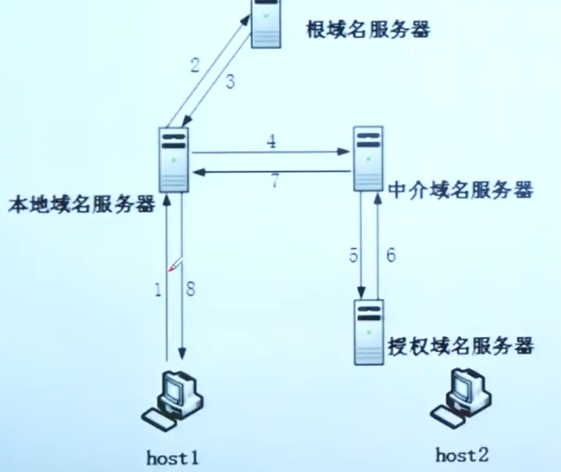
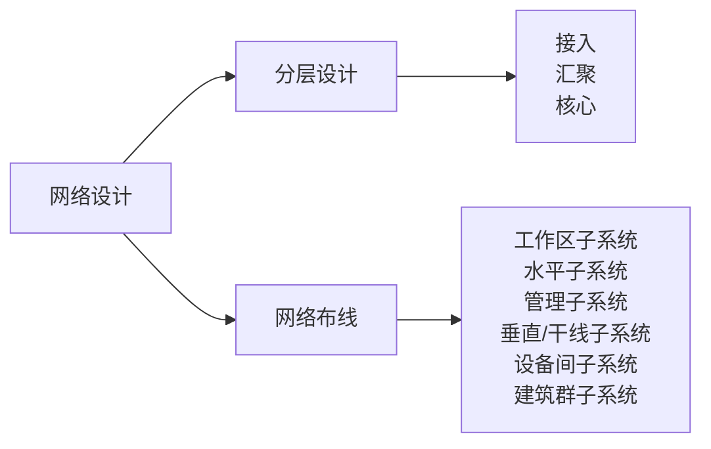
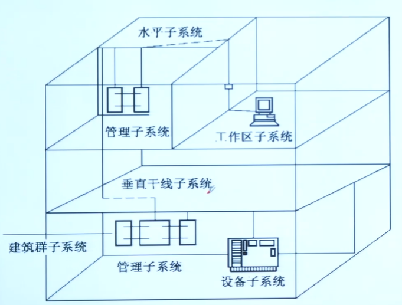

# 概述

> 不重要、分值3分左右，网络有单独的科目

## 网络互联模型

OSI七层 -》 TCP/IP四层（实际使用）

# 网络协议与标准

| 应用层 | 传输层 | 网络层 |
| ------ | ------ | ------ |
| FTP    | TCP    | IPV4   |
| HTTP   | UDP    | IPV6   |
| DHCP   |        |        |
| DNS    |        |        |

---

| 应用层协议 |                说明                |  端口  |
| :--------: | :--------------------------------: | :----: |
|    FTP    |                TCP                | 21、20 |
|    TFTP    |                UDP                |   69   |
|    HTTP    |                TCP                |   80   |
|   HTTPS   |                HTTP                |  443  |
|    DHCP    | 多服务器时，客户端以第一个报文为准 |        |
|    DNS    |        踢皮球迭代、全干递归        |        |

> DNS：由域名得到 IP
>
> PTR：由 IP 得到域名

---

| 传输层协议 | 特点                                                 | 场景                             |
| ---------- | ---------------------------------------------------- | -------------------------------- |
| TCP        | 可靠、连接、字节流服务。校验重传、流量控制、拥塞控制 | 数据量少，可靠性要求高           |
| UDP        | 不可靠、无连接、报文                                 | 数据量大，可靠性要求不高，速度快 |

---

| 网络层协议 | 特点                                  |
| ---------- | ------------------------------------- |
| IPV4       |                                       |
| IPV6       | 单播 多播/组播 任播（最近） |

过渡技术：共存、IPV4网络部署隧道、网关翻译映射。

# 网络设计

| 分层           | 说明                                     | 示例                   |
| -------------- | ---------------------------------------- | ---------------------- |
| **接入** | 面向用户，用户管理功能，用户信息收集工作 | 认证、计费、IP&MAC地址 |
| **汇聚** | 数据包处理、过滤、寻址                   |                        |
| **核心** | 高速转发通信，双机冗余热备份             |                        |

| 网络布线                  | 说明                                 | 示例                 |
| ------------------------- | ------------------------------------ | -------------------- |
| **工作区子系统**    | 终端设备连接到信息插座               | 计算机、电话、摄像机 |
| **水平子系统**      | 同一楼层，连接干线与用户工作区       |                      |
| 管理子系统                | 管理水平与垂直相交                   |                      |
| **垂直/干线子系统** | 主设备间到各层管理间                 |                      |
| 设备间子系统              | 设备间的电缆、连接跳线架、支撑硬件等 |                      |
| **建筑群子系统**    | 多个建筑物连接在一起                 |                      |

